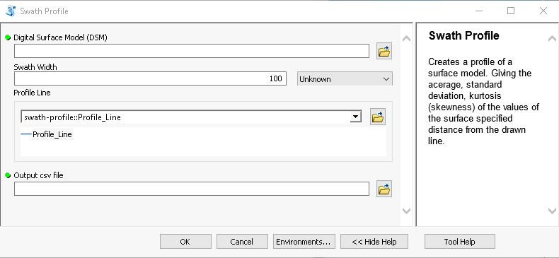
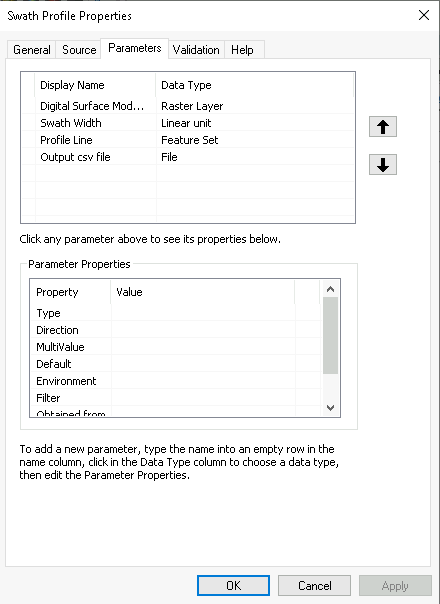

# arcmap-swath-profile
A simple tool that creates a swath profile from a Digital Surface Model (DSM). 
The tool is written for ArcMap 10.x and is therefore in Python 2.7

A swath (width) is specified for a profile of a digital surface model.
The various statistics is then calculated for the swath and placed into a csv file. 
This can then be used to create a profile.

## Usage
The tool takes four parameters. 
The Digital Surface Model
The width of the swath to use
The output csv file

By clicking on the profile line you can draw your profile line interactively on the map. 
Note that one limitation of the tool is that it only does a straight line profile.

## Method
The tool works by taking the DSM and rotating it so it is vertical. 
It then calculates the statistics for each row of the DSM. 

The general method is discussed in the following link.
https://sites.google.com/site/sorsbysj/geospatial-processing/geospatial-analyses/swath-profiles

## Setup
The tool uses standard libraries that are installed with ArcGIS 10.x so there is no need for any extra libraries to be installed. The settings for the tool parameters are as follows.

You may need to set a a schema for the feature set, for the profile line.
Simply select an empty line feature class. Would pay to use the same projection as the digital surface model for this.

